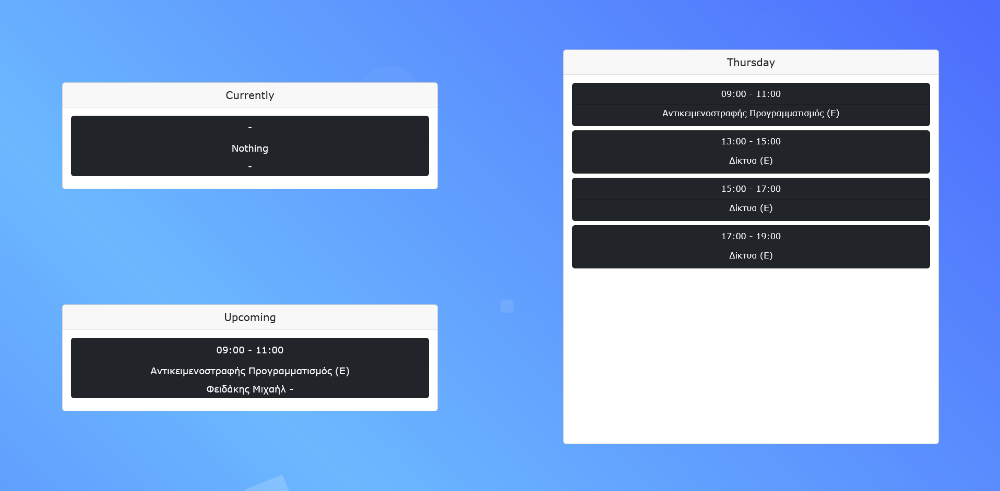
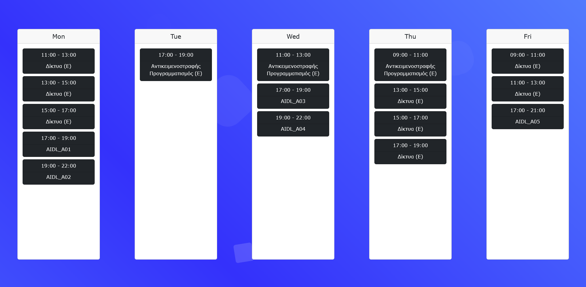
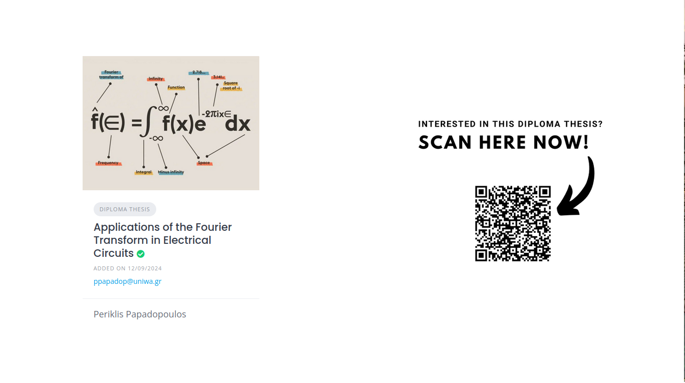

## LabPortal

LabPortal is a React js web app created that showcases the weekly schedule and multiple pictures
about a university lab. It is meant to be placed on monitors outsite the labs to display any info
needed.

Checkout out the demo [here](https://vaggm.github.io/LabPortal/)!

**The project doesn't have to be installed!** It can be configured and run as a github automatically
based on the workflow provided.

## Create your own LabPortal!

To create your own copy of this website you just have to fork this repository and set your own configurations!
The workflow will make sure to load your configuration and set the app running.

The [config directory](./config/) contains the following:
- a weekly schedule file named [schedule.xlsx](./config/schedule.xlsx), with all the lab classes throughout the week
- a set of images to display within the [/config/images/](./config/images/) directory
- a set of display configurations

Once a new push is done on the main branch, any updates on these files will be passed to the github page
which will be available at:

```
https://{GITHUB_USERNAME}.github.io/LabPortal/
```

## Features

This web-app showcases a weekly schedule by swapping between a daily display,
a weekly display and some loaded images. Swaps happen every few seconds based 
on a timer from the configurations.

Daily display:

- current and upcoming classes for the day
- all classes for the day



Weekly display:

- all classes for the whole week



The schedule is read from an excel file of the following format.
(the excel read happens from the [corresponding automation file](./automation-scripts/excelToObject.js) in the workflow)

> Every cell that has multiple lines writter is considered a class.
>
> The first line is its name and the second is its professor.
>
> The line of the cells represents the time of the class
> (lines 3 to 15 are converted to 09:00 to 21:00 and are assumed
> to take up one hour). If the cell is merged horizontally it will
> add to its total hour length.
> 
> The column of the cells represents the day of the class
> (columnes B to G are converted to Monday throuh Saturday).

The schedule should be saved in the configurations directory. Check the example file [here](./config/schedule.xlsx).

Image display:

- show each image from the corresponding config directory



The app will do enough swaps to go through all the images in the data folder.
It accepts .png, .jpg, .jpeg and .gif.

## App Settings

The app can be modified through a settings.json file in the configurations folder.
An example settings file can be found [here](./config/settings.json).

| Setting Name | Description |
| --- | --- |
| dailysplit | split limit for showcases classes on daily display |
| weeklysplit | split limit for showcases classes on weekly display |
| time | swap timer between displays or images |

## Known Issues

The current version of the app doesn't work well
with low resolution devices and components may
get on top of each other.

## Future plans

1) Mobile compatibility
2) Optional display of weekly schedule
